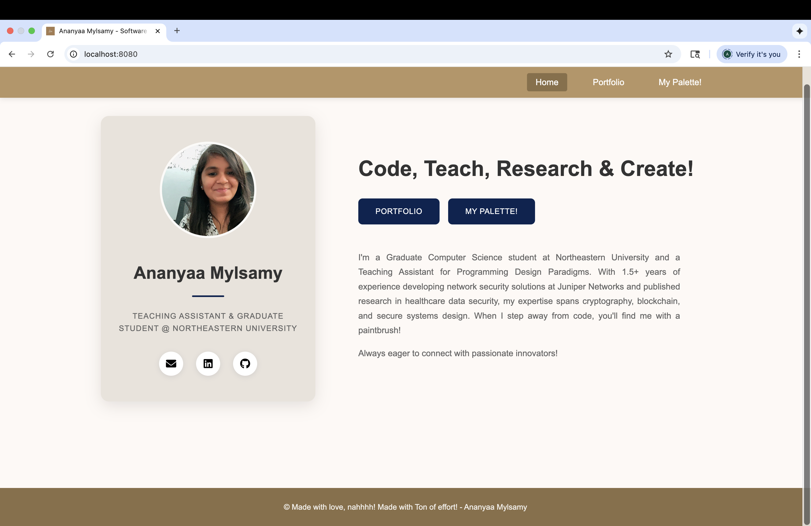

# Ananyaa Mylsamy - Personal Homepage

## Author
Name: Ananyaa Mylsamy  
Email: mylsamy.a@northeastern.edu  
NUID: 002022427

## Web Development 
Course link: https://northeastern.instructure.com/courses/226004

## Objective
To create a personal homepage showcasing professional and personal portfolio as a MS Computer Science student, Teaching Assistant, Researcher and Artist. The website is designed using vanilla HTML, CSS, and ES6+ JavaScript. 

## Features
- **Personal website with 3 pages** Home, Portfolio, My Palette.
- **Homepage** Displays photograph, name, designation, custom message and short introduction. 
- **Portfolio** Displays publications and technical projects, graduation countdown.
- **My Palette [AI Generated]** Displays creativity, art board linked, my art gallery displayed.

## Creative Features
- **Real-time Graduation Countdown**: Dynamic JavaScript feature that calculates and displays time remaining until graduation [May 8, 2027]
- **Interactive Art Gallery**: Mosaic-style layout with hover effects displaying my artwork and floating particle animations.

## Screenshots
### Homepage


### Portfolio Page  


### Art Gallery


## File Structure
```
project-root/
├── index.html              # Main homepage with profile card
├── work.html               # Portfolio page with publications and projects
├── palette.html            # Art page
├── package.json            # Project dependencies and scripts
├── README.md               # This file
├── css/
│   ├── layout.css          # Shared styles (navigation, footer, common elements)
│   ├── homepage.css        # Homepage-specific styles
│   ├── work.css            # Portfolio page styles
│   └── palette.css         # Art page styles
├── js/
│   ├── main.js             # Main JavaScript functionality with graduation countdown
│   └── palette.js          # Art interactive effects
└── images/
    ├── favicon.ico         # Site icon
    ├── profile-photo.jpg   # Profile picture
    └── artwork[1-8].jpg    # Art gallery images
```

## Technologies Used
- HTML
- CSS
- JavaScript ES6+

## Instructions to Build

### Prerequisites
- Node.js installed on your system
- http-server package [installed via npm]

### Setup Steps
1. Clone repository
2. Navigate to the project directory in terminal
3. Install dependencies:
   ```bash
   npm install
   ```

### Running the Project
1. Start the development server:
   ```bash
   http-server
   ```

2. Open website at `http://127.0.0.1:8080`


## GenAI Usage Documentation

### AI Software
- **Claude** 

### How

1. **Brainstorming**
   - Prompts: "I have my resume, my webpage expected layour drawn, features I need to include as a graduate student, let me know if I missed any sections"
   - Used to brainstorm my webpage

2. **My Palette Code and Implementation**
   - Prompts:Create an artistic webpage where I can navigate to a drawing board, display my art gallery, additional creative features, an art quote, make it black background with colourful parts.
   - This part of the project was supposed to be AI generated to compare to my web page.

3. **Resolving git issues**
   - Prompt: "(base) ananyaamylsamy@Ananyaas-MacBook-Pro mylsamy.a % git push -u origin main error: src refspec main does not match any error: failed to push some refs to 'github.com:ananyaamylsamy-lab/ananyaa.git' How do I fix this issue"
   - Faced issues while uploading project to github, used AI to resolve this.


## License
MIT License - Permission is hereby granted to use, copy, modify, and distribute this software.

## Contact
- Email: mylsamy.a@northeastern.edu
- LinkedIn: [linkedin.com/in/ananyaa-mylsamy/](https://www.linkedin.com/in/ananyaa-mylsamy/)
- GitHub: [github.com/Anumyl](https://github.com/Anumyl)

---
